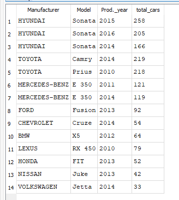
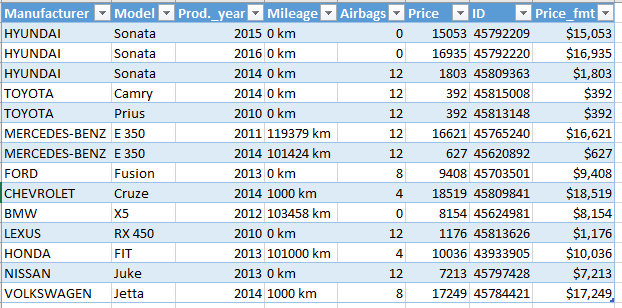

# Final End-to-End Data Analytics Pipeline (SQL · Python · Tableau)

## Project Overview
This project implements a complete, decision-driven data analytics pipeline to optimize vehicle
inventory selection for a small car dealership.

Starting from a large, noisy dataset (~19,000 vehicles), the pipeline applies structured data
curation, business-driven filtering, and rule-based selection to produce a final inventory of
**14 optimal vehicles** targeted at middle-class buyers.

The emphasis of this project is not visualization alone, but **how analytical decisions are made,
validated, and explained across the pipeline**.

---

## Business Problem
A small car dealership cannot stock hundreds of vehicles. Inventory decisions must balance
affordability, reliability, safety, and market demand while minimizing financial risk.

The goal of this project is to determine **which limited set of vehicles provides the best overall
value**, under real-world business constraints.

Key constraints include:
- Maximum price threshold
- Preference for lower mileage
- Emphasis on safety features (airbags)
- Representation across multiple manufacturers
- Avoidance of low-volume or statistically unreliable models

---

## Data Pipeline & Decision Logic

### 1. Data Curation & Reduction (SQL)
The original dataset contains approximately **19,000 vehicles**, many of which are low-volume,
duplicative, or statistically unreliable.

SQL is used to:
- Identify high-volume manufacturers
- Aggregate vehicle counts by model and production year
- Select the most statistically representative model–year combinations
- Reduce the dataset to a focused, analytically reliable subset

This step ensures that all downstream decisions are based on **signal rather than noise**.

#### SQL Model Selection Output
The table below represents the output of the SQL reduction step, where the dataset is reduced to
the most representative model–year combinations per manufacturer.

---

### 2. Rule-Based Selection (Python)
After SQL reduces the dataset to representative model–year combinations, Python applies explicit
business rules to select **one optimal vehicle per model**.

Selection logic includes:
- Price ceiling enforcement
- Mileage minimization
- Safety prioritization (airbag count)
- Tie-breaking using production year and price

This stage represents the **core decision-making logic** of the project.

#### Final Vehicle Selection (Python Output)
The final output is a curated inventory of 14 vehicles, exported as a reproducible CSV file that
can be reused for validation or downstream analysis.

---

### 3. Visualization & Validation (Tableau)
Tableau is used as the final validation and communication layer.

The dashboard enables:
- Visual comparison of price across selected vehicles
- Mileage trade-off analysis by manufacturer
- Validation that business rules produce coherent, defensible results
- Clear explanation of *why* each vehicle was selected

#### Final Vehicle Selection Dashboard
The dashboard represents the **final validated output** of the SQL → Python → Tableau pipeline.

---

## Project Structure
